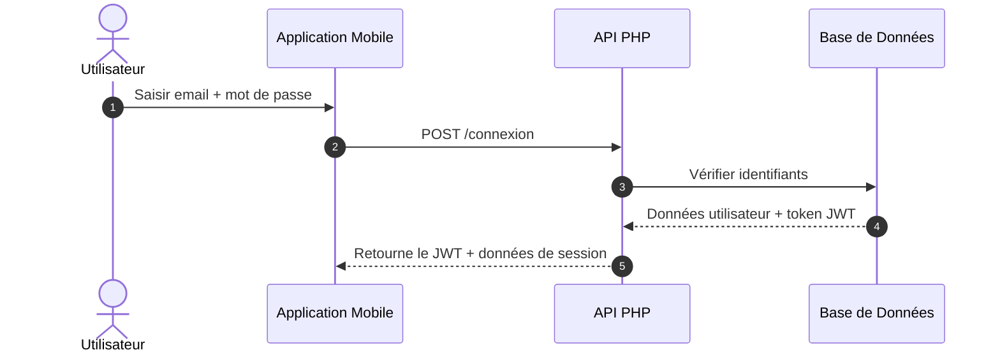

# 🌡️ Warmly – Écosystème IoT pour Radiateurs Connectés

**Warmly** est une alternative personnelle et améliorée à la solution Heatzy, développée de manière autonome dans le cadre de mon BTS CIEL (Cybersécurité, Informatique et réseaux, Électronique). Ce projet permet de piloter, automatiser et superviser des radiateurs électriques à distance.

---

## 📷 Démonstration Vidéo
👉 **[Regarder la vidéo de présentation et de démonstration (YouTube)](https://youtu.be/BLQS33lYxwc)**

---

## 🎯 Objectifs du projet
* **Pilotage à distance :** Contrôle de radiateurs via une application mobile multiplateforme.
* **Automatisation :** Création et application d'un planning de chauffe intelligent.
* **Supervision (Observabilité) :** Suivi en temps réel (graphiques) de la consommation électrique, de la température et de l'humidité.
* **Alerting :** Système de notifications push instantanées lors des changements d'état ou d'anomalies.

---

## 🔧 Stack Technique & Protocoles
* **Matériel (IoT) :** Microcontrôleur **ESP8266** (C++ Arduino), capteurs environnementaux, gestion du Fil Pilote.
* **Réseau & Protocoles :** **MQTT** (Script JS), HTTP / REST, requêtes asynchrones, Wi-Fi.
* **Backend / Serveur :** API PHP + Node.js sur **serveur LAMP** (Linux, Apache, MySQL, PHP).
* **Application Mobile :** React Native (TypeScript).

---

## 📁 Structure du dépôt
* `Frontend/` : Code source de l'application mobile en React Native (TypeScript).
* `Backend/` : 
  * `warmly_api/` : API PHP pour la gestion des utilisateurs, des équipements et des données.
  * `warmly_scripts/` : Scripts Node.js (gestion des notifications et tâches planifiées).
* `ESP8266/` : Code embarqué (C++ Arduino) du microcontrôleur (Wi-Fi, Fil Pilote, Capteurs).
* `Docs/` : Diagrammes de classe et de séquence (PlantUML / Mermaid) détaillant l'architecture.

---

## 🛠️ Compétences Support, Système & Réseau développées
Ce projet valide des compétences clés directement transférables au **Support Informatique et à l'Administration Système** :

* **Administration & Système (Linux/LAMP) :** * Déploiement et sécurisation d'un serveur web Linux.
  * Gestion et requêtage d'une base de données relationnelle (MySQL/MariaDB).
  * Maintenance du serveur : gestion des droits d'accès, nettoyage et optimisation de la BDD.
* **Réseau & Protocoles :**
  * Configuration réseau de l'ESP8266 (appairage Wi-Fi, attribution IP).
  * Utilisation de protocoles légers et industriels (**MQTT**) et d'architectures d'API (REST).
* **Troubleshooting & Analyse (Le cœur du métier de support) :**
  * **Analyse de logs** serveur et applicatifs pour identifier les pannes.
  * Diagnostic et résolution de dysfonctionnements réseau (pertes de paquets, timeouts, codes d'erreur HTTP).
  * Tests d'intégration et débogage matériel/logiciel en autonomie.

---

## 🙋‍♂️ Auteur
* *LinkedIn :* https://linkedin.com/in/walidkabli
* *GitHub :* https://github.com/wkabtech


## 📊 Architecture, Flux Réseaux & Diagrammes
*Cliquez sur les sections ci-dessous pour dérouler et analyser les flux et l'architecture technique du projet.*

<details>
<summary><b>👁️ Diagramme de Classe : Architecture du Code ESP8266</b></summary>
<p>Structure orientée objet du firmware embarqué (C++) gérant les capteurs, le Wi-Fi et les ordres Fil Pilote.</p>

```mermaid
classDiagram
  class Main {
    -wifiClient : WiFiClient
    -mqttClient : PubSubClient
    -fp : FilPilote
    -consommation : Consommation
    -temperature : Temperature
    -configManager : ConfigManager
    -setup()
    -loop()
    -callback()
    -reconnectMQTT()
    -envoyerStatutConnexion()
  }

  class ConfigManager {
    -creds : WifiCredentials
    -server : ESP8266WebServer
    -dns : DNSServer
    -configValid : bool
    +begin()
    +startConfigPortal()
    +handleClient()
    +resetConfig()
    +supprimerRadiateurServeur()
    +getSSID()
    +Password()
    +getUtilisateurId()
    +getPieceId()
    +getRadiateurId()
    +getToken()
  }

  class Consommation {
    -pinA0 : int
    -energieWh : float
    -serverUrl : String
    -authToken : String
    -radId : int
    +mesurerEtCalculer()
    +setRadiateurId()
    +setToken()
    +setUrl()
  }

  class Temperature {
    -dhtPin : int
    -serverUrl : String
    -authToken : String
    -radId : int
    +begin()
    +envoyerTemperature()
    +setRadiateurId()
    +setToken()
    +setUrl()
  }

  class FilPilote {
    -gpioAlternancePositive : int
    -gpioAlternanceNegative : int
    +confort()
    +eco()
    +arret()
    +horsGel()
    +confortMoins1()
    +confortMoins2()
    +commandeOrdres()
  }

  class OTA {
    +setupOTA()
    +checkForOTA()
    +checkOTAIntervalle()
    +handleOTAMQTT()
  }

  Main *-- ConfigManager
  Main *-- Consommation
  Main *-- Temperature
  Main *-- FilPilote
  Main *-- OTA
